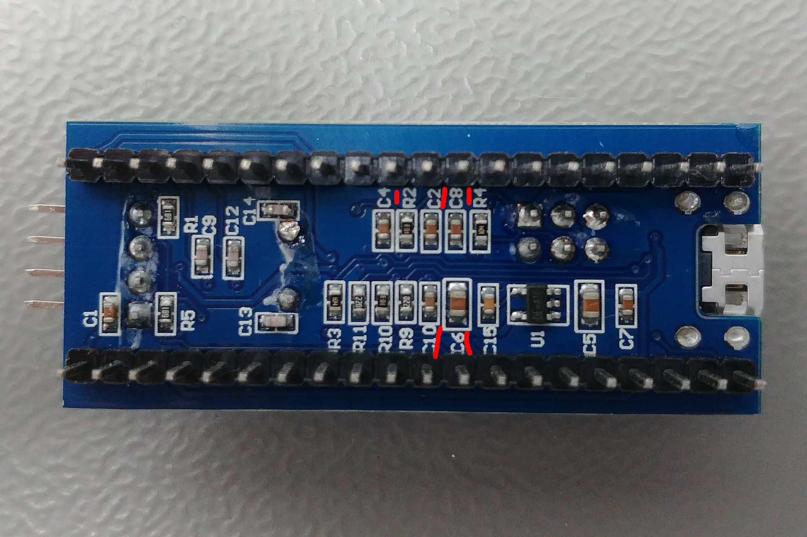
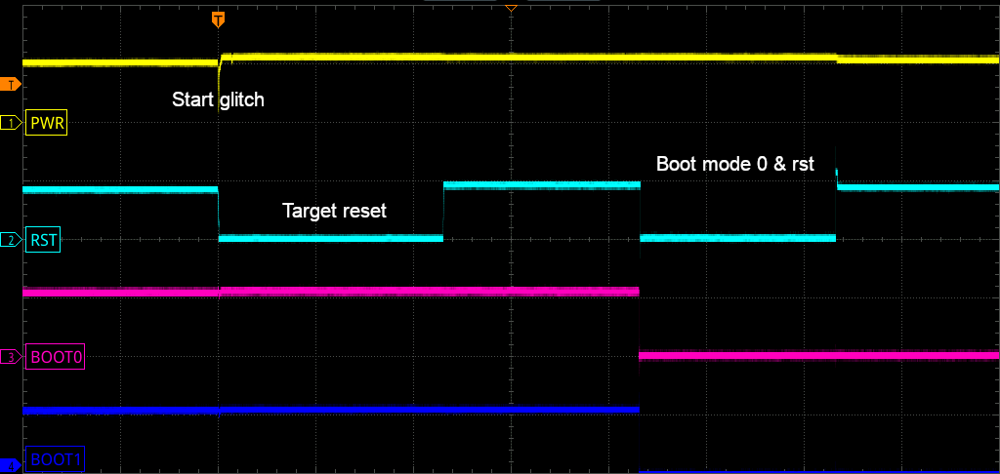

# A QUICK(ish) LOOK AT STM32 HARDWARE SECURITY (PART 2)

***28/12/21***

***Continue from [the last part](../CVE-2020-13466/cve-2020-13466.md). In this post I'll attempt to perform physical attack on STM32F1, I will follow \[[1]\] and go through 3 different setups and test if the exploit is successful or not.***

***TL,DR: This is a log of my attempts, I will study the vulnerability further in future post.***

## 1. CVE-2020-13466 Briefing

From the paper, exploitation process is executed in few stages:

  1. Setup - In this stage, we use a debugger to load exploitation firmware \[[2]\] into SRAM of our target, this firmware will configure Flash Patch and Breakpoint Unit (FPB). Boot mode is then set to SRAM.
  2. Glitch - The power glitch is executed in this stage. Power is turned off for a fraction of a second, enough to reset flash lock from debugger access in previous stage but not long enough for SRAM to lose their data. The firmware will configure FPB.
  3. Reset - Boot mode is set back to flash, then apply reset signal. FPB configuration remains. Boot is diverted to SRAM code. Flash is accesible since the device boot from flash.

## 2. Setup

I'll leave boring reading part in the next post. we go hands on this time.

During my experiment with this vulnerability I came up with 3 different hardware setups. But due to a bad USB, all data (waveform, images...) of first 2 setups are lost. You will have to take my words for it.

All setup will use a control board to control boot mode and monitor target board rst line. Control board is overclocked to 128Mhz with libopencm3.

The target is a bluepill board loaded with blink.

To make control and capturing waveform more manageable, I wire up a button to manually start the exploit.

### 2.1. First Setup

At first, I attempted to create a proper programable power supply to the target board with a transistor and a isolated power supply module.

The reason for the isolated power supply is if I were to put the target board directly as load, I cannot use oscilloscope to measure signal from control board and target board at the same time, since probes share the same ground and would short out the transitor, making it useless.

However, with isolated power, the ground of 2 sides still connect through the scope.

Using this setup to cut power. The fall time measured for target power line is horrible, it takes more than 500us to trigger the target reset. Although rise time is closer to what described in the paper, it probably still not ideal. The exploit does not work.

### 2.2. Second Setup

Needless to say I must improve fall time for VCC line. Reading instructions in \[[2]\]. I removed the \'power supply\' part entirely, 2 pins is now used to drive the target\'s power.

The power fall time indeed improved to around 20us as well as the rise time. However the exploit code still does not run.

There can be more than one problem:

1. Rise and fall time not fast enough.
2. The glitch does not clear the debug flash lock or SRAM data got erased.
3. BFP data not preserved (unlikely).

I can test for 2nd problem by leaving the bootmode config untouched (0). Then we can read out the SRAM. But for problem #1 I need to remove bypass capacitor on the target.

### 2.3. Removing Bypass Caps

Based on \[[3]\], Capacitor C2, C3, C4, C6, C8, C10 and C11 need to be removed, But only C2, C4, C6, C8, C10 present on the board.

Final waveform is shown below. Vertical 3V/div & Horizontal 500us/div. More detail can be found in controller source code in src directory.

Exploit code ran!! Shell pop on target serial line. Read and Write commands work, but Dump command return exception. The detail of shell code source and BFP will be the topic of the next post.

## 3. Questions Remain

- How does one discover these vulnerability?
- During testing of the glitch, there are times when the exploit does not run. How does one identify the cause?

## References

1. [https://www.usenix.org/conference/woot20/presentation/obermaier](https://www.usenix.org/conference/woot20/presentation/obermaier)
2. [https://github.com/JohannesObermaier/f103-analysis/tree/master/h3](https://github.com/JohannesObermaier/f103-analysis/tree/master/h3)
3. [https://stm32-base.org/assets/pdf/boards/original-schematic-STM32F103C8T6-Blue_Pill.pdf](https://stm32-base.org/assets/pdf/boards/original-schematic-STM32F103C8T6-Blue_Pill.pdf)

[1]: https://www.usenix.org/conference/woot20/presentation/obermaier
[2]: https://github.com/JohannesObermaier/f103-analysis/tree/master/h3
[3]: https://stm32-base.org/assets/pdf/boards/original-schematic-STM32F103C8T6-Blue_Pill.pdf
